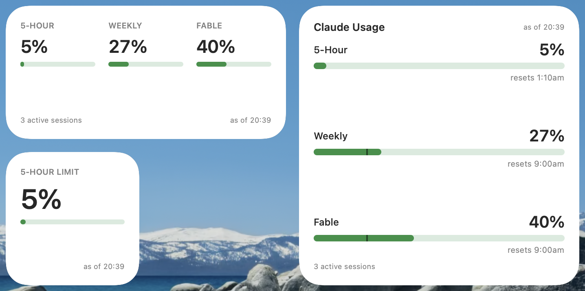

# ClaudeWidget

A macOS menu bar app with a companion desktop widget that shows your current Claude usage — 5-hour, weekly, and Opus-tier limit percentages — up to the minute, with a live burn-rate estimate so a limit never comes as a surprise.




## Privacy & Security

- Reads your Claude Code sign-in token to check usage — never writes or refreshes it.
- Talks to `api.anthropic.com`, using your own token, to check your usage.
- Checks GitHub's release infrastructure on a schedule for app updates, and downloads them only with your permission.
- All data stays in this app's local storage on your Mac.
- No usage data, analytics, or crash reports are ever sent anywhere.

## Features

- Menu bar readout of your 5-hour, weekly, and Opus-tier (Fable) usage percentages, refreshed at least every minute.
- A smoothed burn-rate estimate and a time-to-limit projection, so you can see how fast usage is being consumed right now.
- A companion desktop widget (small, medium, and large) showing the same live snapshot.
- Per-project session insight: which projects are burning usage and today's totals across models.
- Smart notifications before you hit a limit — threshold warnings, a projected-overrun heads-up, and a reset notice — tuned to avoid noise from brief bursts of activity.
- Automatic updates: ClaudeWidget can keep itself current. It asks permission first, checks on a standard schedule, and installs updates in place through the familiar macOS update dialog. Automatic downloading stays off unless you turn it on.

## Requirements

- macOS 26 (Tahoe) or later.
- [Claude Code](https://claude.com/claude-code) installed and signed in — ClaudeWidget reads its existing sign-in token rather than asking you to log in again.

## Install & First Run

1. Download the latest `ClaudeWidget.zip` from the [Releases page](../../releases), then unzip it.
2. Move `ClaudeWidget.app` to your Applications folder.
3. ClaudeWidget is notarized by Apple but not distributed through the App Store, so on first launch, right-click (or Control-click) the app and choose **Open**, then confirm **Open** in the dialog that appears. This one-time step is normal for apps distributed outside the App Store and lets Gatekeeper verify the app before running it. Subsequent launches open normally.
4. On first run, ClaudeWidget will ask for two optional permissions:
   - **Launch at Login** — so the menu bar item is there when you log in. You can turn this on or off at any time in Settings.
   - **Statusline relay** — an optional local hook into Claude Code's statusline that gives ClaudeWidget an additional, ToS-clean source of usage data. Declining this is fine; ClaudeWidget still works from the official usage endpoint.
5. Once running, click the menu bar icon to see your usage at a glance. Add the desktop widget from the macOS Widget Gallery for an ambient view.

### Checking for Updates

ClaudeWidget checks for new versions on a standard schedule and always asks before installing anything. You can also check on demand from **Settings → Updates → Check for Updates**. Automatic downloading is off by default and can be turned on in Settings.

## Uninstall

ClaudeWidget installs four things on your Mac, and both uninstall paths below remove all four:

1. The app bundle itself (`/Applications/ClaudeWidget.app`).
2. A login item (so the app can start automatically at login).
3. A small local data folder (an App Group container used to share data between the app and the widget).
4. The statusline relay hook in `~/.claude`, if you installed it.

### Option A: In-app

Open ClaudeWidget's Settings and choose **Uninstall ClaudeWidget…**. Confirm the dialog. This restores your original Claude Code statusline configuration, unregisters the login item, removes ClaudeWidget's local data, and moves the app itself to the Trash.

### Option B: Uninstall script

A copy of `uninstall.sh` is bundled at the top level of the release zip, next to the app, and is also available directly from this repository:

```bash
curl -fsSL https://raw.githubusercontent.com/nicwittison/claudewidget-releases/main/uninstall.sh -o uninstall.sh
bash uninstall.sh
```

The script lists what it finds before removing anything, and asks for a single confirmation. Pass `--yes` to skip the confirmation for scripted use. It unregisters the login item while the app bundle is still present (this is expected — the login item is removed first, then the app is moved to the Trash last), and it is safe to run at any time: if some or all of these artifacts are already gone, it reports that and continues without error.

## Distribution Notice

ClaudeWidget is provided as-is, with no warranty of any kind. It is an independent project and is not affiliated with, endorsed by, or sponsored by Anthropic. This notice describes the terms under which the compiled app is distributed — it is not an open-source license, and no license to the source code is granted.

## Support

Found a bug or have a question? Please [open an issue](../../issues) on this repository. If you're reporting a crash, use the crash report template — it'll ask you to attach your crash log.
